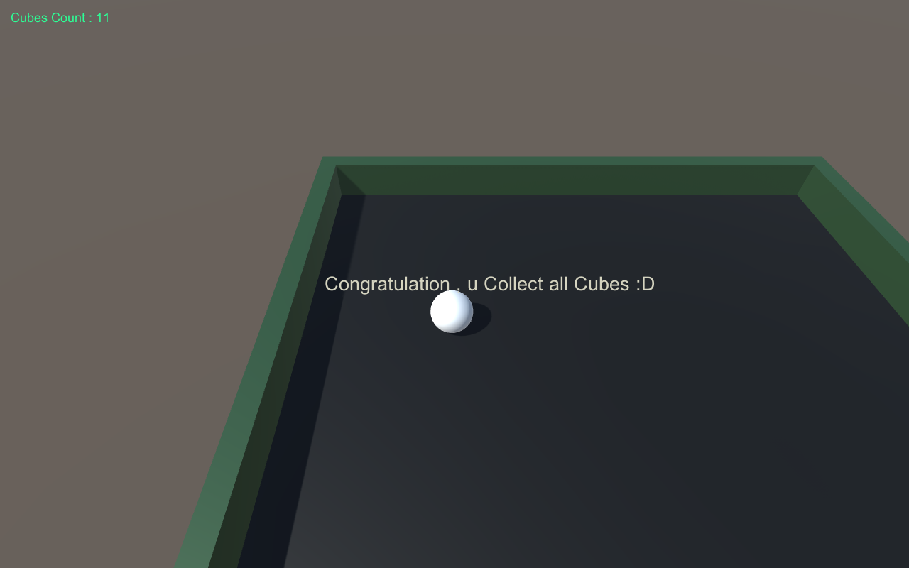

<h1 align="center">
   :point_right: RollaBall-Game :smile:
</h1>
Simple game called "Roll a Ball Game"

======
When you start Playing

======
and finally

======
<h2 align="center">
  Congratulation , 
  You Collect all Cubes in the Game :joy: :joy: 
</h2>
###Tutorial Will help you :
   * [Unity Official Site](https://unity3d.com)
   * [Unity Documentation](https://docs.unity3d.com/Manual/index.html)
   * [Roll-a-ball tutorial](https://unity3d.com/learn/tutorials/projects/roll-ball-tutorial)

======
